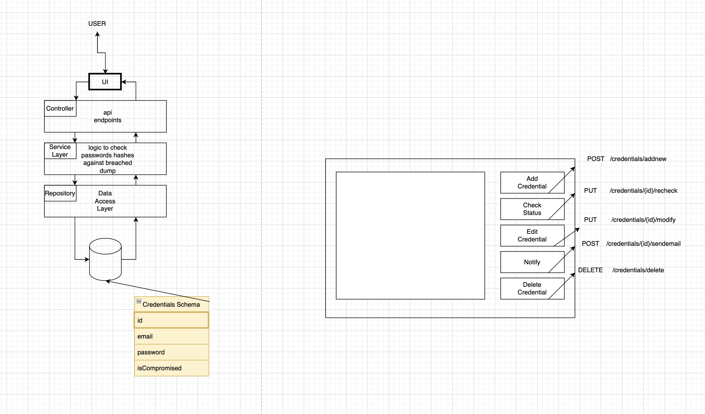

# Breach-Monitoring
# Data Breach Monitoring Web App

The aim of this project is to allow a user to easily monitor a list of credentials, giving them the option to notify them and/or each individual user
based on their use case (personal / enterprise)

##

[ done ] Backend - MVC style architecture Java Spring backend with a mySQL database

[ in progress ] Frontend - Mapping endpoints to React 

## 
Backend for a web application built with Java + Spring + Maven + Redis 

Exposes endpoints for a react front end to fetch

Business logic grabs user list of credentials input and puts it in a redis database
uses redis search indexing, and other cloud tools to allow the user to look at the database, search it in an SPA

allows users to individual/multiple select and click buttons that perform the respective requests to the RESTful endpoint
_________________________________________________________________________________________________________________________________________________
[to do]                     
implement a cache w/ redis

_______________________________________________________________________________________________________________________________________
## **MODEL**
credential schema

schema:
{
email
username
password
compromisedStatus
}

_________________________________________________________________________________________________________________________________________________
## **CONTROLLER**

Endpoints - Main Route -  (/credentials)

**/addnew**

add a credential to your list
needs email || username

**/recheck**

pulls credentials and performs a check depending on what information is available, can check email, password, and/or both
updates compromisedStatus

**/delete**

deletes selected credentials from tables

**/sendemail***

Notifies selected emails with twilio sendgrid that their password showed up in a breach and should be updated

_________________________________________________________________________________________________________________________________________________
**VIEW**
React Frontend
[in progress]
  
 
